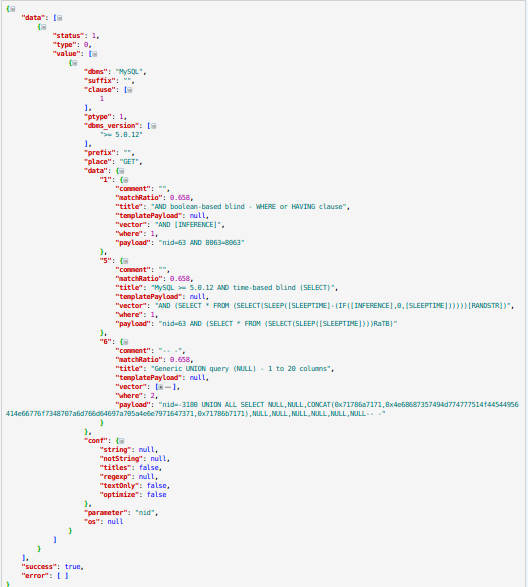
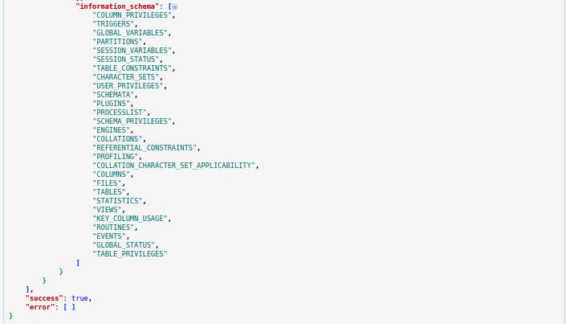

#AutoSqli(update 2016.1.13)

##What is sqlmap
> Sqlmap is an open source penetration testing tool that automates the process of detecting and exploiting SQL injection flaws and taking over of database servers. It comes with a powerful detection engine, many niche features for the ultimate penetration tester and a broad range of switches lasting from database fingerprinting, over data fetching from the database, to accessing the underlying file system and executing commands on the operating system via out-of-band connections.
   
   >[**get more infomation at www.sqlmap.org**](www.sqlmap.org)

##What is sqlmapapi
> Sqlmap is a excelente SQL injection and exploit tool,but our work still is inefficient.Each URL needs to be tested manual.The author of Sqlmap realized this problem and writed sqlmapapi to fix this.Only after using sqlmapapi to detect SQL injection flaws,you can feel how powerful the sqlmap is.
   
   >[**you can download sqlmap and sqlmapapi at github project**](https://github.com/sqlmapproject/sqlmap)
   
##What is AutoSqli
AutoSqli is a web application that provide a hommization UI of sqlmap.It has easy methods to building a SQL detection and managing test missons.You don't have to open two terminals as server and client,and type many commands like [*use <task id\>*],[*status*] or [*data*] and so on.

**AutoSqli has four fundamental pages**

* ####QuickBuild
This page provides the most basic function:*check a URL with some parameters like [www.example.com/index.php?id=2] wether has SQL flaws.*That means all parameters of sqlmap **except 'url'** will be false or null.

* ####CustomTask
This page is the core of this application.You can select many parameters and fill in cookies of url you want to test.

* ####TaskList
You can view and manage all task you have built in this application.It will refresh automatically every 1 second.Each task has a status.When status is *terminated*,the detect is done.You can click log and data to view scan log and result,of course you can delete this task.

* ####Instruction
This page introducts functions of all sqlmapapi's parameters.

##How to use AutoSqli

1. ####Preparation
    * [Download Sqlmap](https://github.com/sqlmapproject/sqlmap)

    * Python 2.7 enviroment

    * Flask Framework *[how to install flask?](http://      dormousehole.readthedocs.org/en/latest/)*

    * [Download AutoSqli application](https://github.com/LeeHDsniper/AutoSqli)

2. ####Extract sqlmap file to the document where your python is
3. ####Run sqlmapapi.py as server

    * If you use Linux,maybe these commands are useful:
     `cd /usr/lib/python2.7/sqlmap-master`
     `sudo python ./sqlmapapi.py -s`

    * If you use Windows,you need to run a command prompt with administrator privilege and use `cd` get in document where sqlmap-master is
     Type:`python sqlmapapi.py -s`

4. ####Run AutoSqli,py
You can use `sudo python AutoSqli.py`(Linux) or `python AutoSqli.py`(Windows)

5. ####Open your browser and visit 127.0.0.1

##Something need to be improved eagerly

1. ####More perfect way to exhibit result of scan
I have tried many ways to convert json data of result to a html table,but when I added two or more parameters to scan,the json data returned by sqlmapapi is so complicated that it is hard to convert.***This is json data of a detect with one parameter***

    
    When I converted this to a html table,the result was acceptable barely.***But when parameter was two:***

It is so complicated that I have to use these code to convert it:
   
    ***...snip...line 82***

        for data_item in response_data:
            if type(data_item['value'])==list:
                data_html=data_html+self.list_2_html(data_item['value'])
            elif type(data_item['value'])==dict:
                data_html=data_html+self.dict_2_html(data_item['value'])
            else:
                data_html=data_html+self.str_2_html(data_item['value'])
        data_html=re.sub("u'","",data_html)
        self.taskid_data_Dict[taskid]=data_html
    ***...snip...line 92***

        def list_2_html(self,data_list):
            data_html='<table border="1">'
            for i in range(0,len(data_list)):
                if type(data_list[i])==dict:
                    for item in data_list[i]:
                        data_html=data_html+'<tr><td class="item">'+str(item)+'</td><td>'+str(data_list[i][item])+'</td></tr>'
                else: 
                    data_html=data_html+'<tr><td class="item">'+str(i)+'</td><td>'+data_list[i]+'</td></tr>'  
        data_html=data_html+"</table>"
            return data_html
        
        def dict_2_html(self,data_dict):
            data_html='<table  border="1">'
            for key in data_dict:
                data_html=data_html+'<tr><td class="item">'+str(key)+'</td><td>'+str(data_dict[key])+'</td></tr>'
            data_html=data_html+"</table>"
            return data_html
        
        def str_2_html(self,data_unknown):
            data_html='<table  border="1"><tr><td class="item">'+str(data_unknown)+'</td></tr></table>'
            return data_html
    ***...snip...line 111***
    
    How to convert scan result to a perfect exhibition is the most important problem I have.

2. ####Many parameters are not added at customtask page
[All parameters](set_options.txt) of sqlmapapi that can be used in a scan task are too many. I don't think the way in customtask page to add paramters is good enough at present*(2015/11/28,there are four paramters in customtask page)*.If I add all 168 parameters to the page,it must be very long and not elegant.So I am still thinking a perfect way to fix it.Another reason is,I don't understand the function of each parameter.
3. ####More automatical functions
Now*(2015/11/28)* the only thing I think is useful and worth mentioning is URL Duplicated Removal.
   
    ***...snip...line 143***
    
         def URL_Dupl(self,targetURL):
            m=re.match('(http://)|(https://)',targetURL)
            if m is None:
                targetURL="http://"+targetURL
            option_list=[]
            m=re.match('(.+)\?',targetURL)
            if m is None:
                return 0         # return 0 means illegal URL 
            else:
                option_list.append(m.groups()[0])
            temp_list=re.findall('(\&\w+=)',targetURL)
            for i in temp_list:
                if i!="":
                    option_list.append(i)
            temp_list=re.findall('(\?\w+=)',targetURL)
            for i in temp_list:
                if i!="":
                    option_list.append(i)        
            result=[]
            for key in self.taskid_url_Dict:
                url=self.taskid_url_Dict[key]
                status=True
                for reg in option_list:
                    if '&' in reg or '?' in reg:
                        m=re.search('\\'+reg,url)
                    else:
                        m=re.search(reg,url)
                    if m is None:
                        status=False
                        break
                if status:
                    result.append(url)
            if len(result):
                return -1      #return -1 means find url is similar to targeturl
            else:
                return 1       #return 1 means no url is similar to targeturl 
   
    Actually,there are many interesting ideas like:
    
    * We can assume *www.example.com/index.php?id=1* is an URL we test,maybe we are glad to see that AutoSqli can test *www.example.com/index.php?uid=1*  and *www.example.com/index.php?nid=1* .
    * When we finished a test,we would like to generate a pdf file to save all data and log.AutoSqli should can provide a link for download.

## Epilogue

This project has many flaws (∩_∩)，or I can say it just begin.Maybe it will be more perfect someday in spite of SQL injection is more and more difficult now.I do not have enough knowledge and time to improve it,but I expect someone can make this be a useful tools in SQL injection.
   
At last,I am particularly grateful to **Manning**, the Author of the topic:[使用sqlmapapi.py批量化扫描实践](http://drops.wooyun.org/tips/6653?utm_source=tuicool).His topic gave me too much inspiration and experience,*[set_options.txt](set_options.txt)* in my project is copy from [his project](https://github.com/manning23/MSpider).Thanks again.Also thanks to the team members of sqlmap.
#Update 2016.1.13
##Use Sqlite database

It must be admitted that using dict to restore data is stupid.It triggered many problems like that you can see all tasks on server wether or not you built them.You can check and delete task that doesn't belong to you.Another problem is obviously,these dictionary variables will be too big one day.

Actually sqlite is not a perfect chioce.I'd glad to use MySQL instead of sqlite.But write and read mysql in Flask is not convenient any way.So I use sqlite at last.

The database:Autosqli.db has one table Autosqli.This table has eight columns:
>|   taskid   |   url    |   url_parameters   |   options   |    log     | status   |         data       |  user  |

##Delete Autosqli class

My original intention of encapsulating Autosqli class is ...Ok,I don't know,maybe I'm affected by C# and want to use 'public','private','protect' on variable and functions.Just forget this stupid idea.

##Delete tasklog.html page

I have been hesitanting a while before doing this cause most of tasks  will create many logs.I don't think it is beautiful to show them on page tasklist,but opening a new page to see logs is inconvenient.At last,I use a div which is hidden at first,and when you click button 'log',it will be visiable.The skills are Ajax and jquery.

##I find a perfect way to show task's data!!![hahhah]
I know it is shameful to steal other people's code,but... forget this too.I found a [website](http://json.phpddt.com/) that can analyse json data,those pictures above were shotcuted from that website.I copied the [javascript code](/static/js/c.js) which is used to analyse json data from that website and did some modification.I have to salute to the author of these code,you are genius!
